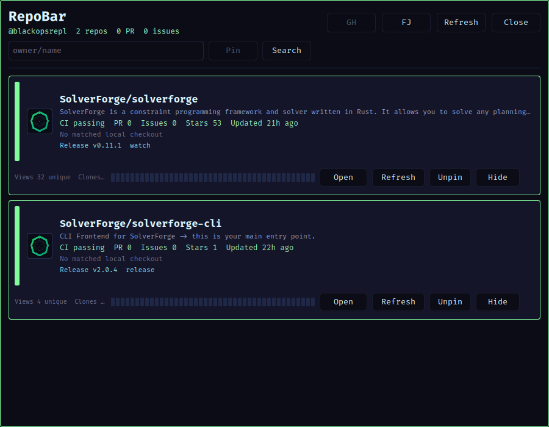

# RepoBar Linux

<p align="center">
  
</p>

Linux-first RepoBar implementation for SolverForge Linux and Waybar, built in Ruby with a QuickShell frontend.

This repository is inspired by [steipete](https://github.com/steipete)'s original [RepoBar](https://github.com/steipete/RepoBar). It keeps the repository-pressure product idea, but implements a native Linux surface with a cached Ruby backend, a thin Waybar chip, and one QuickShell popover.

## Screenshot



## Runtime

- Ruby CLI in `bin/repobar`
- GitHub auth through the existing `gh` token
- local Forgejo support through `http://vigilance:3002/api/v1`
- Cached state in `~/.local/state/repobar/`
- Config in `~/.repobar/config.json`
- Resident refresh loop via `repobar daemon`
- Waybar renderer via `repobar waybar render`
- QuickShell frontend at `frontend/quickshell/shell.qml`

## Commands

```bash
bin/repobar auth status
bin/repobar config init
bin/repobar config github
bin/repobar config forgejo
bin/repobar config validate
bin/repobar provider github
bin/repobar provider forgejo
bin/repobar refresh
bin/repobar daemon
bin/repobar repos
bin/repobar search fizzy
bin/repobar repo openclaw/openclaw
bin/repobar issues openclaw/openclaw
bin/repobar pulls openclaw/openclaw
bin/repobar releases openclaw/openclaw
bin/repobar ci openclaw/openclaw
bin/repobar tags openclaw/openclaw
bin/repobar branches openclaw/openclaw
bin/repobar contributors openclaw/openclaw
bin/repobar commits openclaw/openclaw
bin/repobar activity openclaw/openclaw
bin/repobar local
bin/repobar local sync openclaw/openclaw
bin/repobar worktrees openclaw/openclaw
bin/repobar pin openclaw/openclaw
bin/repobar settings show
bin/repobar cache status
bin/repobar panel
bin/repobar ui status --format json --pretty
bin/repobar waybar render
bin/release-check
```

## Product Scope

RepoBar defaults to GitHub.com, where real user issues and pull requests live,
and can switch to the local Forgejo instance when needed. It shows repository
pressure and local checkout state from the active provider:

- open issues and pull requests
- stars and forks
- latest pushed activity
- latest release
- latest Actions run status
- recent activity summary
- matched local branch, dirty files, and ahead/behind state
- GitHub rate-limit health
- Forgejo public repository activity at `http://vigilance:3002`
- RepoBar-owned JSON API cache and Discrawl-style archive import into SQLite via `sqlite3`

Not in v1:

- macOS Swift/AppKit runtime
- GitHub App OAuth loopback flow
- Keychain storage
- Sparkle/Homebrew packaging
- terminal or Wofi fallback UI

## Waybar Behavior

The bar reads cached state only. GitHub fetches happen during `repobar refresh` or in `repobar daemon`.
The Waybar chip starts with `GH` or `FJ` to show the active provider.

- Left click: open the QuickShell popover
- Middle click: refresh now
- Right click: open the QuickShell popover

The chip carries state classes for CSS:

- `healthy`
- `loading`
- `stale`
- `error`
- `has-work`
- `has-ci-failures`
- `local-dirty`
- `rate-limited`
